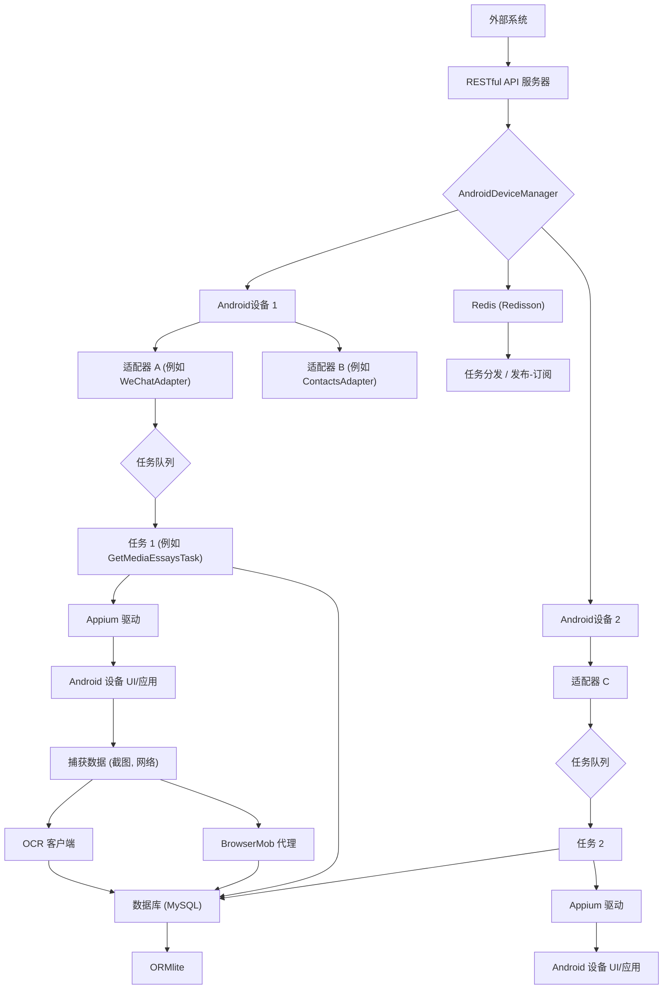

---

## 中文

### 简介

Android Automator 是一个功能强大且灵活的基于 Java 的框架，专门设计用于自动化 Android 设备上的任务并从各种移动应用程序中收集数据。它利用 Appium 进行 UI 交互，ADB 进行设备控制，并集成了 OCR 和网络流量拦截等高级功能，以实现全面的数据提取。虽然它可以扩展到任何 Android 应用程序，但其主要焦点和最完善的功能都集中在自动化微信任务上。

### 核心特性

* **多设备管理：** 高效并发管理多台 Android 设备（物理设备或 Genymotion 等模拟器）。
* **并发任务执行：** 使用健壮的线程池和回调机制，支持在不同设备和账户之间并行执行自动化任务。
* **账户生命周期管理：** 提供全面的应用程序账户管理，包括登录、状态跟踪（正常、异常、冻结）和无缝的账户切换。
* **应用程序特定适配器：**
    * **微信适配器：** 为微信自动化高度开发，支持公众号搜索、关注/取关、历史文章抓取、实时消息监控、联系人管理和群聊创建等任务。
    * **通讯录适配器：** 用于自动化与原生 Android 通讯录应用的交互（添加、删除、清空联系人）。
    * **钉钉适配器：** 钉钉联系人管理的基本功能。
* **高级数据提取：**
    * **OCR 集成：** 利用 OCR 服务（如百度 OCR）从截图中提取文本，这对于处理动态或基于图像的 UI 元素至关重要。
    * **代理拦截：** 使用 BrowserMob Proxy 拦截和分析网络请求及响应，允许直接从 API 调用中提取数据。
* **RESTful API 外部控制：** 暴露了一个 Web API（使用 Spark 框架），用于提交任务、监控设备状态、管理账户以及获取操作概览。
* **数据持久化：** 集成 ORMLite 进行对象关系映射，将收集到的数据（如微信消息、联系人、文章、任务日志）持久化到 MySQL 数据库中。
* **分布式任务管理：** 利用 Redisson (Redis 客户端) 进行分布式队列和主题管理，用于任务提交和实时消息处理。

### 架构概览

该框架采用分层架构，以确保模块化和可扩展性：

* **设备层：** `AndroidDevice` 和 `AndroidDeviceManager` 管理物理或虚拟 Android 设备，包括 Appium 驱动生命周期、ADB 交互和设备状态管理。
* **适配器层：** 抽象的 `Adapter` 类及其具体实现（例如 `WeChatAdapter`、`ContactsAdapter`）封装了特定于应用程序的自动化逻辑。每个适配器都与一个 `Account` 和 `AppInfo` 相关联。
* **任务层：** 抽象的 `Task` 类及其子类定义了具体的自动化工作流（例如 `GetMediaEssaysTask`）。任务通过 `TaskHolder` 对象启动，并由设备特定的执行器执行。
* **工具层：** 提供数据库操作、图像处理、Shell 命令和各种通用帮助程序的常用功能。
* **API 层：** 用于与核心自动化逻辑交互的外部接口。

<!-- end list -->



### 设置与安装

#### 前提条件

* **Java 开发工具包 (JDK) 8 或更高版本：** 确保已设置 `JAVA_HOME`。
* **Android SDK：** 并在系统 PATH 中配置了 `platform-tools` (ADB)。
* **Node.js 和 npm：** Appium 所需。
* **Appium Server：** 通过 npm 全局安装：`npm install -g appium`。
* **Appium Java Client：** 由 Gradle 依赖管理。
* **Redis Server：** 运行中的实例，用于任务队列和消息传递。
* **MySQL Server：** 用于数据持久化。
* **ChromeDriver (可选但推荐)：** 用于自动化 Android 应用中的 WebView 上下文（例如微信内部浏览器）。

#### 步骤

1.  **克隆仓库：**
    ```bash
    git clone [https://github.com/rewind-one/android-automator.git](https://github.com/rewind-one/android-automator.git)
    cd android-automator
    ```
2.  **配置数据库：**
    * 根据 `src/main/resources/conf/PooledDataSource.conf` 创建 MySQL 数据库（例如 `android_automator`、`raw`、`requester`）。
    * 如有必要，更新 `PooledDataSource.conf` 中的数据库凭据。
    * 运行 `DBUtil.initDB(false)` （或 `DBCreateTable` JUnit 测试）创建必要的表。
3.  **配置 Redis：**
    * 更新 `src/main/resources/conf/RedissonAdapter.conf` 中的 Redis 连接详情。
4.  **安装 Appium 依赖：**
    * 确保已安装 Appium 服务器 (`npm install -g appium`)。
    * 找到您的 Appium `main.js` 文件（例如 Linux 上通常是 `/usr/local/lib/node_modules/appium/build/lib/main.js`），如果需要，请更新 `AndroidDevice.java`（第 289-299 行）.
5.  **为代理安装 CA 证书 (可选但 HTTPS 拦截需要)：**
    * 为 BrowserMob Proxy 生成 `ca.crt` 和 `pk.crt`。将它们放在项目根目录。
6.  **构建项目：**
    ```bash
    ./gradlew clean build
    ```

### 使用

1.  **启动 Android Automator API 服务器：**

    ```bash
    java -jar build/libs/task-android-automator.jar # 或在您的 IDE 中运行 `one.rewind.android.automator.api.server.AndroidServer.main()`
    ```

    服务器启动后，将检测已连接的 Android 设备并对其进行初始化。

2.  **通过 API 提交任务：**
    您可以使用 Postman、curl 等工具，或使用提供的 `APIMainServerTest` JUnit 测试 或 `AutomationClient` 来提交任务。

    示例（使用 `APIMainServerTest.java` 中的 `testFetchEssaysTaskAPI`）：

    ```java
    // 示例：提交一个任务以抓取特定公众号的文章
    String mediaNick = "小青投资笔记";
    ImmutableMap<String, Object> params = ImmutableMap.of(
            "params", ImmutableList.of(mediaNick),
            "udid", "ZX1G227PZ7", // 指定设备 UDID
            "class_name", GetMediaEssaysTask1.class.getName() // 任务类名
    );
    // 将此 'json' 提交到 [http://127.0.0.1:4567/android_automator/submit](http://127.0.0.1:4567/android_automator/submit)
    ```

    请参考 `one.rewind.android.automator.api.server.Routes.java`，了解可用的 API 端点及其预期的 JSON 有效负载。

### 项目结构 (部分)

```
.
├── src
│   ├── main
│   │   ├── java
│   │   │   └── one
│   │   │       └── rewind
│   │   │           └── android
│   │   │               └── automator
│   │   │                   ├── account             # 账户模型与管理
│   │   │                   ├── adapter             # 基础适配器及应用特定适配器 (例如：微信、通讯录、钉钉)
│   │   │                   ├── api                 # RESTful API 服务器与客户端
│   │   │                   ├── callback            # 设备与任务事件回调
│   │   │                   ├── deivce              # Android 设备管理 (Appium, ADB 交互)
│   │   │                   ├── exception           # 自定义异常
│   │   │                   ├── genomotion          # Genymotion 相关工具
│   │   │                   ├── log                 # 自定义日志模型
│   │   │                   ├── process             # 进程管理工具
│   │   │                   ├── service             # API 服务器主入口
│   │   │                   └── task                # 基础任务、任务持有者、任务工厂
│   │   └── resources
│   │       └── conf          # 配置文件 (数据库、Redis、OCR 客户端)
│   └── test
│       └── java
│           └── one
│               └── rewind
│                   └── android
│                       └── automator
│                           ├── adapter             # 适配器功能测试
│                           ├── api                 # API 服务器/客户端测试
│                           ├── call                # 并发执行测试
│                           ├── db                  # 数据库测试
│                           ├── device              # 设备管理测试
│                           ├── file                # 文件/图像工具测试
│                           ├── guava               # Guava 工具测试
│                           ├── listener            # Appium 监听器测试
│                           ├── mobile              # 移动设备特定测试
│                           ├── model               # 模型测试
│                           ├── ocr                 # OCR 测试
│                           ├── task                # 任务管理测试
│                           └── util                # 通用工具测试
├── build
├── log
├── tmp                   # 临时文件 (截图、代理日志)
└── ...
```

### 贡献

欢迎贡献！请随时提交问题或拉取请求。
