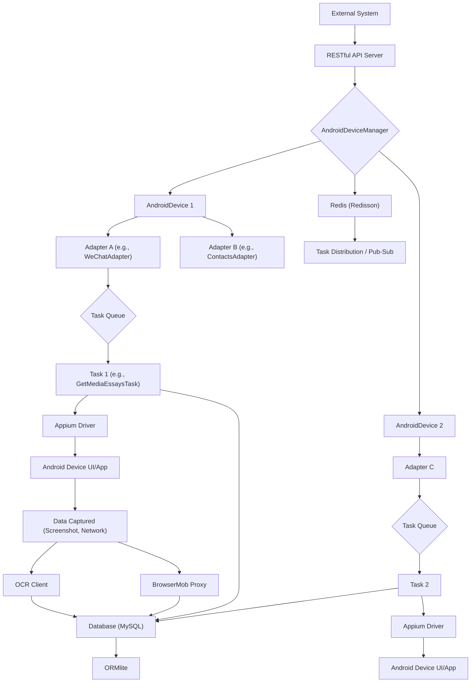

# Android Automator

## English

### Introduction

Android Automator is a powerful and flexible Java-based framework designed for automating tasks on Android devices and collecting data from various mobile applications. It leverages Appium for UI interaction, ADB for device control, and integrates with advanced features like OCR and network traffic interception to facilitate comprehensive data extraction. While extensible for any Android application, its primary focus and most developed features are geared towards automating tasks on WeChat.

### Key Features

* **Multi-Device Management:** Efficiently manages multiple Android devices (physical or emulators like Genymotion) concurrently.
* **Concurrent Task Execution:** Supports parallel execution of automation tasks across different devices and accounts using a robust thread pool and callback mechanism.
* **Account Lifecycle Management:** Provides comprehensive management of application accounts, including login, status tracking (normal, broken, frozen), and seamless account switching.
* **Application-Specific Adapters:**
    * **WeChat Adapter:** Highly developed for WeChat automation, enabling tasks like public account searching, subscribing/unsubscribing, historical article scraping, real-time message monitoring, contact management, and group chat creation.
    * **Contacts Adapter:** For automating interactions with the native Android Contacts app (add, remove, clear contacts).
    * **DingTalk Adapter:** Basic functionalities for DingTalk contact management.
* **Advanced Data Extraction:**
    * **OCR Integration:** Utilizes OCR services (e.g., Baidu OCR) to extract text from screenshots, crucial for handling dynamic or image-based UI elements.
    * **Proxy Interception:** Employs BrowserMob Proxy to intercept and analyze network requests and responses, allowing for direct data extraction from API calls.
* **RESTful API for External Control:** Exposes a web API (using Spark framework) for submitting tasks, monitoring device status, managing accounts, and retrieving operational overviews.
* **Data Persistence:** Integrates with ORMLite for object-relational mapping to persist collected data (e.g., WeChat messages, contacts, essays, task logs) into a MySQL database.
* **Distributed Task Management:** Leverages Redisson (Redis client) for distributed queues and topics to manage task submission and real-time message processing.

### Architecture Overview

The framework follows a layered architecture to ensure modularity and extensibility:

* **Device Layer:** `AndroidDevice` and `AndroidDeviceManager` manage the physical or virtual Android devices, including Appium driver lifecycle, ADB interactions, and device state management.
* **Adapter Layer:** Abstract `Adapter` class with concrete implementations (e.g., `WeChatAdapter`, `ContactsAdapter`) encapsulate application-specific automation logic. Each adapter is associated with an `Account` and an `AppInfo`.
* **Task Layer:** Abstract `Task` class and its subclasses define specific automation workflows (e.g., `GetMediaEssaysTask`). Tasks are initiated via `TaskHolder` objects and executed by device-specific executors.
* **Utility Layer:** Provides common functionalities for database operations, image processing, shell commands, and various helpers.
* **API Layer:** An external interface for interacting with the core automation logic.

